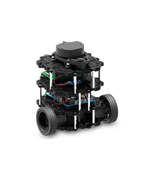
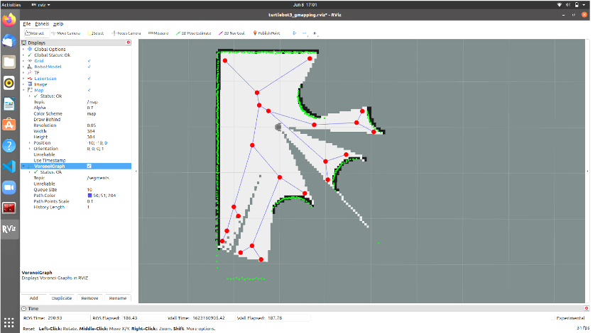
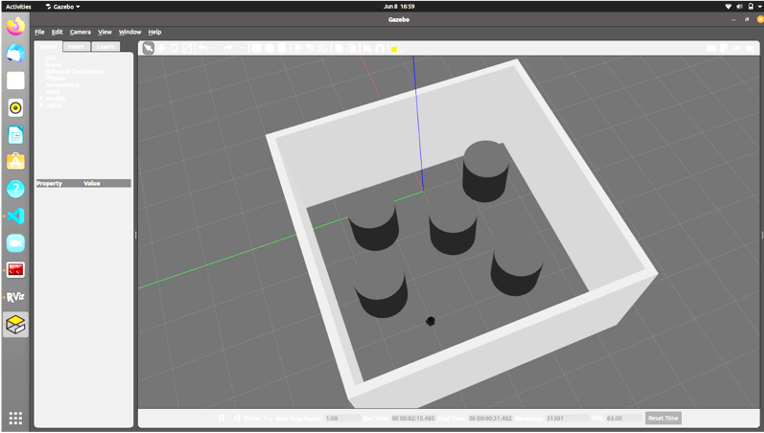
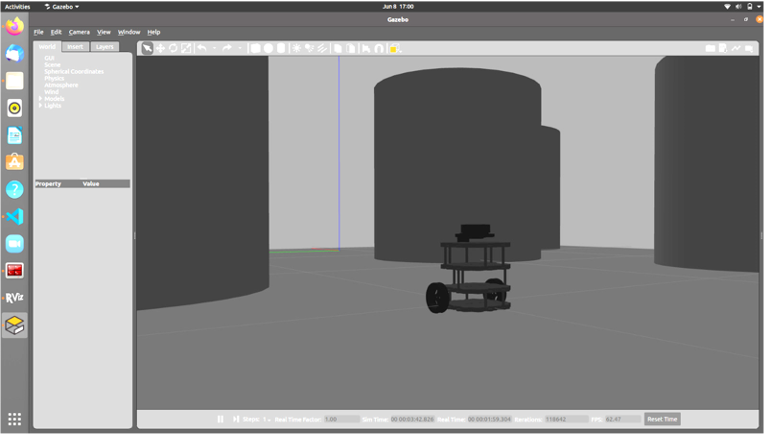
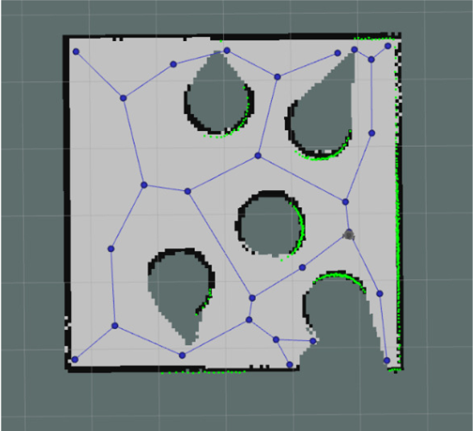
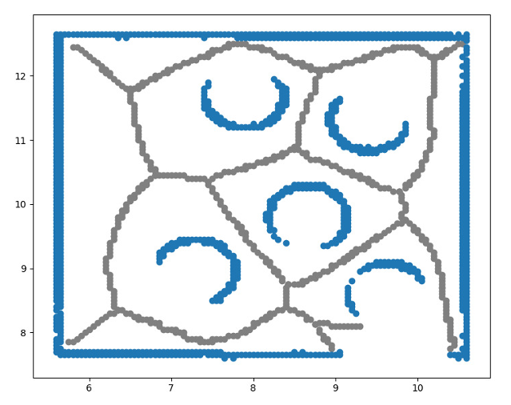
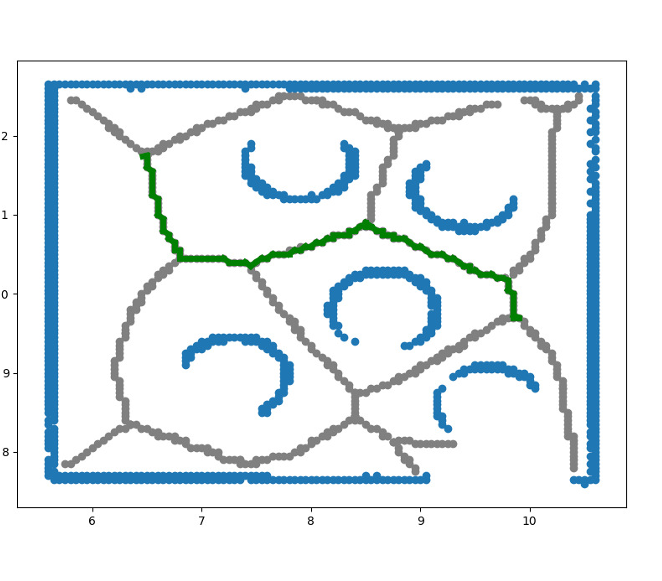
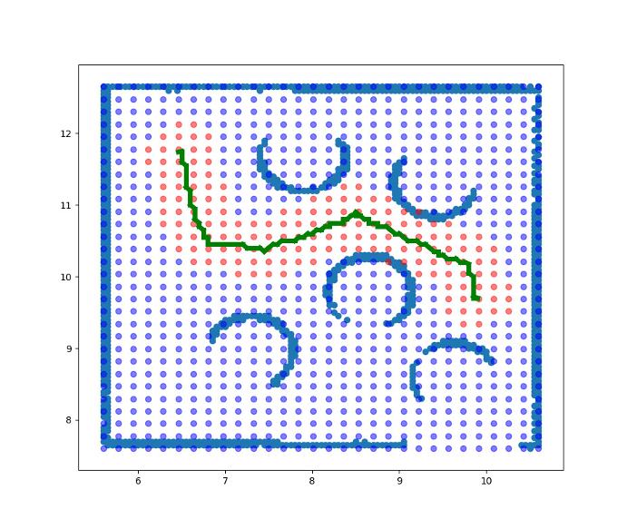
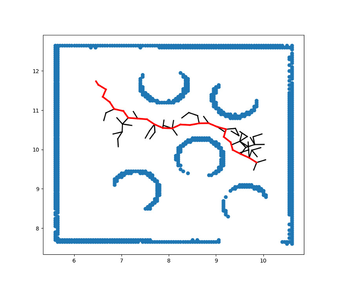

# Voronoi + A* + RRT

This repository is a part of an assignment in
Robot's Control and Navigation Course (2021 Semester B).

## Paper

[Optimal Path Planning Using Generalized Voronoi Graph and Multiple Potential Functions](https://ieeexplore.ieee.org/document/8948325)

## Structure

The main parts of code are located in [/src](/src) directory.

[`a_star.py`](/src/astar.py) - our simple and generic implementation of A*.
More explanation about the A* implementation can be found
in [this](https://github.com/Arseni1919/A_star_Implementation) repository.

[`RRT.py`](/src/astar.py) - our simple and generic implementation of RRT.
More explanation about the RRT implementation can be also found
in [this](https://github.com/Arseni1919/Simple_Implementation_of_RRT) repository.

[`main_find_path.py`](/src/main_find_path.py) - the main flow of path planning.
The file contains ROS node that responsible to build a path for robot.

## Simulation

We worked with TurtleBot3 robot, Gazebo simulation and Rviz.

TurtleBot3 | Rviz
------------ | -------------
 | 

Gazebo (1) | Gazebo (2)
------------ | -------------
 | 

## Main Logic of The Algorithm

### Voronoi Graph

We used [`tuw_voronoi_graph`](http://wiki.ros.org/tuw_voronoi_graph) package to create Voronoi graph.
Then, we transferred it to **x**, **y** coordinates.

Map | Graph
------------ | -------------
 | 

### A* Path

Next, we used [`a_star.py`](/src/astar.py) package to create the shortest path inside Voronoi graph.

Graph | Graph with path
------------ | -------------
 | 

### MPF Distribution

We used `MPFsampling()` function inside [`main_find_path.py`](/src/main_find_path.py)
to create the proper distribution that we will use during RRT sampling process.

Graph with path | Distribution around this path
------------ | -------------
 | 

### RRT algorithm

Then, we used [`RRT.py`](/src/astar.py) to find the desired path to the target
using RRT sampling process with a given MPF distribution.

Distribution around this path | RRT solution
------------ | -------------
 | 

### Movement

And finally, we used `move2()` method inside [`main_find_path.py`](/src/main_find_path.py)
to navigate robot through the found path.

### [🚀 📹 🚗 YouTube video of of an experiment](https://www.youtube.com/watch?v=Je9pdfdcSs0&ab_channel=ArsPerchik)

## Improvement Suggestions

The proposed algorithm can be conveniently implemented on plethora kinds of robots.
The calculations do not demand many resources. Easy to understand basic principles.

As an improvements of our implementation, we can suggest:

- Tuning step size ( the length of a branch in RRT) – it is apple to speed up the convergence
- Tuning sampling parameters – better distribution approximation can increase convergence as well
- Adding robot constrains – consider dynamics of a specific robot

## Credits

- [ROS - `tuw_voronoi_graph`](http://wiki.ros.org/tuw_voronoi_graph)
- [ROS - Odometry](http://docs.ros.org/en/noetic/api/nav_msgs/html/msg/Odometry.html)
- [ROS - Point](http://docs.ros.org/en/melodic/api/geometry_msgs/html/msg/Point.html)

